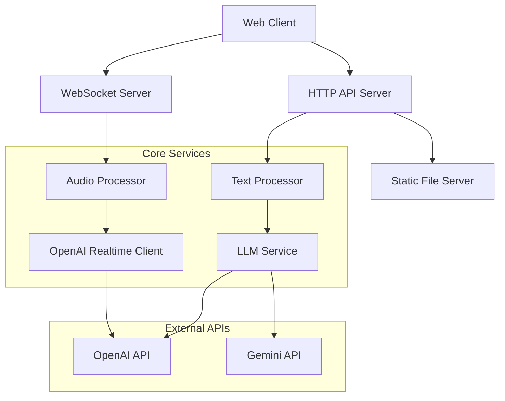

# Design Document: TypeScript Migration for Brainwave

## Overview

This document outlines the design for migrating the Brainwave real-time speech recognition and summarization tool from Python to TypeScript. The migration will modernize the backend architecture while preserving all existing functionality and improving type safety, maintainability, and developer experience.

The new TypeScript implementation will use Node.js runtime with modern frameworks and tools, maintaining API compatibility with the existing Python version while introducing better error handling, type safety, and development workflows.

## Architecture

### High-Level Architecture



### Technology Stack

- **Runtime**: Node.js 18+ with TypeScript 5+
- **Web Framework**: Fastify (chosen for performance and TypeScript support)
- **WebSocket**: ws library with Fastify WebSocket plugin
- **Audio Processing**: Node.js Buffer and stream processing
- **HTTP Client**: axios for external API calls
- **Configuration**: dotenv for environment management
- **Logging**: pino (structured logging, Fastify-compatible)
- **Testing**: Vitest (fast, TypeScript-native)
- **Build Tools**: tsx for development, tsc for production builds
- **Code Quality**: ESLint, Prettier, TypeScript strict mode

## Components and Interfaces

### 1. Core Server (FastifyServer)

The main application server that orchestrates all components:

```typescript
interface ServerConfig {
  port: number;
  host: string;
  staticPath: string;
  corsOrigins: string[];
}

interface FastifyServerInstance {
  start(): Promise<void>;
  stop(): Promise<void>;
  registerRoutes(): void;
  registerWebSocket(): void;
}
```

### 2. Audio Processing Service

Handles real-time audio stream processing and resampling:

```typescript
interface AudioChunk {
  data: Buffer;
  timestamp: number;
  sampleRate: number;
}

interface ProcessedAudio {
  data: Buffer;
  originalSize: number;
  processedSize: number;
}

interface AudioProcessor {
  processChunk(chunk: AudioChunk): ProcessedAudio;
  resample(data: Buffer, fromRate: number, toRate: number): Buffer;
  validateAudioFormat(chunk: AudioChunk): boolean;
}
```

### 3. WebSocket Connection Manager

Manages real-time client connections and message routing:

```typescript
interface WebSocketMessage {
  type: 'start_recording' | 'stop_recording' | 'audio_chunk';
  data?: any;
  timestamp: number;
}

interface ConnectionState {
  id: string;
  isRecording: boolean;
  openAIClient?: OpenAIRealtimeClient;
  audioBuffer: Buffer[];
}

interface WebSocketManager {
  handleConnection(socket: WebSocket): Promise<void>;
  handleMessage(socket: WebSocket, message: WebSocketMessage): Promise<void>;
  broadcastStatus(socket: WebSocket, status: string): Promise<void>;
}
```

### 4. OpenAI Realtime Client

Manages communication with OpenAI's real-time API:

```typescript
interface OpenAIConfig {
  apiKey: string;
  model: string;
  modalities: string[];
}

interface SessionConfig {
  inputAudioFormat: 'pcm16';
  inputAudioTranscription: null;
  turnDetection: null;
  modalities: string[];
}

interface OpenAIRealtimeClient {
  connect(config: SessionConfig): Promise<void>;
  sendAudio(audioData: Buffer): Promise<void>;
  commitAudio(): Promise<void>;
  startResponse(instructions: string): Promise<void>;
  close(): Promise<void>;
  
  // Event handlers
  onTextDelta(handler: (delta: string) => void): void;
  onResponseComplete(handler: () => void): void;
  onError(handler: (error: Error) => void): void;
}
```

### 5. LLM Processing Service

Handles text processing through various language models:

```typescript
interface LLMRequest {
  text: string;
  prompt: string;
  model?: string;
  stream?: boolean;
}

interface LLMResponse {
  content: string;
  model: string;
  usage?: {
    promptTokens: number;
    completionTokens: number;
  };
}

interface LLMProcessor {
  processText(request: LLMRequest): Promise<LLMResponse>;
  processTextStream(request: LLMRequest): AsyncGenerator<string>;
  validateModel(model: string): boolean;
}
```

### 6. Text Enhancement Services

Provides readability enhancement, AI Q&A, and correctness checking:

```typescript
interface TextEnhancementRequest {
  text: string;
  type: 'readability' | 'ask_ai' | 'correctness';
  language?: 'zh' | 'en';
}

interface TextEnhancementResponse {
  enhancedText: string;
  originalLength: number;
  enhancedLength: number;
  processingTime: number;
}

interface TextEnhancer {
  enhanceReadability(text: string): Promise<TextEnhancementResponse>;
  askAI(question: string): Promise<string>;
  checkCorrectness(text: string): AsyncGenerator<string>;
}
```

## Data Models

### Request/Response Models

```typescript
// API Request Models
interface ReadabilityRequest {
  text: string;
}

interface AskAIRequest {
  text: string;
}

interface CorrectnessRequest {
  text: string;
}

// API Response Models
interface ReadabilityResponse {
  enhanced_text: string;
}

interface AskAIResponse {
  answer: string;
}

interface CorrectnessResponse {
  analysis: string;
}

// WebSocket Message Models
interface WebSocketStatusMessage {
  type: 'status';
  status: 'idle' | 'connecting' | 'connected' | 'processing';
}

interface WebSocketTextMessage {
  type: 'text';
  content: string;
  isNewResponse: boolean;
}

interface WebSocketErrorMessage {
  type: 'error';
  content: string;
}
```

### Configuration Models

```typescript
interface AppConfig {
  server: {
    port: number;
    host: string;
    staticPath: string;
  };
  openai: {
    apiKey: string;
    realtimeModel: string;
    modalities: string[];
  };
  gemini?: {
    apiKey: string;
    defaultModel: string;
  };
  logging: {
    level: 'debug' | 'info' | 'warn' | 'error';
    format: 'json' | 'pretty';
  };
}
```

## Correctness Properties

*A property is a characteristic or behavior that should hold true across all valid executions of a system—essentially, a formal statement about what the system should do. Properties serve as the bridge between human-readable specifications and machine-verifiable correctness guarantees.*

For this migration, we focus on the most critical correctness properties:

### Property 1: API Endpoint Compatibility
*For any* valid HTTP request to an existing Python API endpoint, the TypeScript system should respond with the same endpoint availability and method support
**Validates: Requirements 1.3**

### Property 2: WebSocket Connection Establishment
*For any* client attempting to connect to the WebSocket endpoint, a persistent connection should be successfully established
**Validates: Requirements 2.1**

### Property 3: Audio Resampling Accuracy
*For any* valid audio chunk at 48kHz, the audio processor should produce output at exactly 24kHz
**Validates: Requirements 2.2**

### Property 4: Audio Data Flow Integrity
*For any* processed audio chunk, the system should forward it to OpenAI's API without data loss
**Validates: Requirements 2.3, 2.5**

### Property 5: Configuration Validation
*For any* startup attempt, the system should validate all required configuration parameters and fail gracefully if invalid
**Validates: Requirements 5.4**

### Property 6: Static File Serving
*For any* valid static file request, the system should serve the file with correct content and MIME type
**Validates: Requirements 6.1, 6.4**

These core properties ensure the essential functionality works correctly while keeping the testing scope manageable.

## Error Handling

### Error Classification

The system implements a comprehensive error handling strategy with typed exceptions:

```typescript
// Base error types
abstract class BrainwaveError extends Error {
  abstract readonly code: string;
  abstract readonly statusCode: number;
  readonly timestamp: Date;
  
  constructor(message: string, public readonly context?: Record<string, any>) {
    super(message);
    this.timestamp = new Date();
  }
}

// Specific error types
class AudioProcessingError extends BrainwaveError {
  readonly code = 'AUDIO_PROCESSING_ERROR';
  readonly statusCode = 422;
}

class OpenAIConnectionError extends BrainwaveError {
  readonly code = 'OPENAI_CONNECTION_ERROR';
  readonly statusCode = 503;
}

class ConfigurationError extends BrainwaveError {
  readonly code = 'CONFIGURATION_ERROR';
  readonly statusCode = 500;
}

class ValidationError extends BrainwaveError {
  readonly code = 'VALIDATION_ERROR';
  readonly statusCode = 400;
}
```

### Error Handling Strategies

1. **WebSocket Errors**: Graceful degradation with client notification
2. **Audio Processing Errors**: Buffer management and retry logic
3. **OpenAI API Errors**: Exponential backoff and circuit breaker pattern
4. **Configuration Errors**: Fail-fast on startup with clear error messages
5. **Validation Errors**: Detailed field-level error reporting

### Logging and Monitoring

All errors are logged with structured context including:
- Error type and code
- Request/session identifiers
- Relevant system state
- Stack traces for debugging
- Performance metrics

## Testing Strategy

### Pragmatic Testing Approach

The system focuses on essential testing to ensure core functionality works correctly:

**Basic Unit Tests**:
- Critical path validation (audio processing, WebSocket connections)
- Error handling for external API failures
- Configuration validation

**Manual Testing**:
- End-to-end workflow validation
- Cross-browser compatibility for WebSocket connections
- Audio quality verification

### Testing Framework Configuration

**Primary Framework**: Vitest (lightweight, TypeScript-native)
**Minimal Dependencies**: Focus on built-in Node.js testing capabilities where possible
**Manual Validation**: Emphasis on functional testing during development

### Essential Test Coverage

Focus on testing only the most critical components:

1. **Audio Processing**: Verify resampling works correctly
2. **WebSocket Connections**: Ensure stable client-server communication  
3. **OpenAI Integration**: Validate API communication and error handling
4. **Configuration Loading**: Ensure required environment variables are validated

### Development Workflow

- **Local Testing**: Manual verification during development
- **Integration Validation**: Test complete workflows manually
- **Error Scenarios**: Verify graceful degradation when external services fail

The testing approach prioritizes working functionality over comprehensive coverage, allowing for faster development and deployment while maintaining essential quality checks.